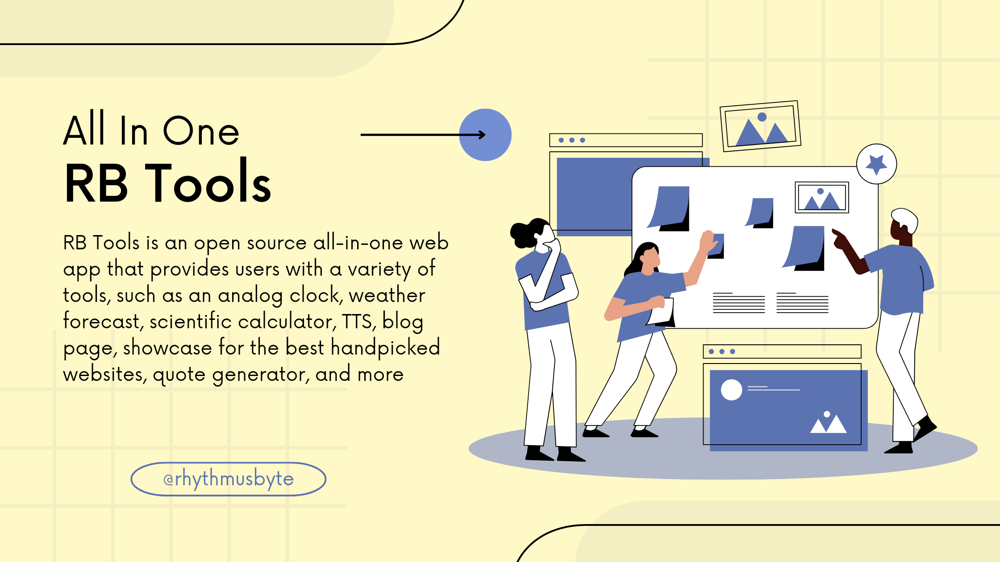

# RB Tools

RB Tools is an open source all-in-one web app that provides users with a variety of tools, such as an analog clock, weather forecast, scientific calculator, TTS, blog page, showcase for the best handpicked websites, quote generator, and more.

---

---

The app is being developed by <a href="https://akhilmahesh.netlify.app/">RhythmusByte</a>. I'm passionate about creating useful and user-friendly apps. I also a strong believer in open source software and is excited to share his work with the community.

The app is still in development, but the following features are planned:

* **Analog clock:** A simple and elegant analog clock that users can use to keep track of time.
  
* **Weather forecast:** A weather forecast that users can use to stay up-to-date on the latest weather conditions.
  
* **Scientific calculator:** A scientific calculator that users can use for complex calculations.
  
* **TTS:** A text-to-speech feature that users can use to have text read aloud to them.
  
* **Blog page:** A blog page where users can read articles about a variety of topics.
  
* **Showcase for websites:** A showcase for the best handpicked websites that users can explore.
  
* **Quote generator:** A quote generator that users can use to generate random quotes.

The app will also have other features that will be added in the future.

The app is divided into several sections:

* **Tools:** This section contains the various tools that are available in the app.
* **About:** This section provides information about the app and its developer.
* **Contact:** This section allows users to contact the developer with questions or feedback.

## Contributing

If you would like to contribute to RB Tools, please feel free to fork the repo and submit a pull request.

## License

RB Tools is licensed under the <a href="https://github.com/RhythmusByte/RB-Tools/blob/alone-patch/LICENSE">MIT Licence</a>.
